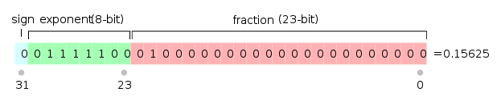
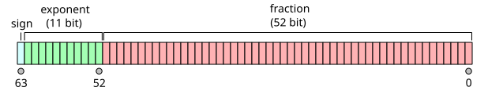

# Guión del video final

Tema: IEEE 754 - Historia y funcionamiento

## Secciones

1. Introducción
2. Historia
3. ¿Como se compone un numero en IEEE754?
4. Pasaje de un numero decimal al estandar
5. Pasaje del estandar a decimal
6. Suma con IEEE754 (?)

### Introducción

### Historia

### ¿Como se compone un numero en IEEE754?

Un numero en IEEE754 se compone de 3 partes: El bit de signo (1 bit), el exponente (8 bits en simple precision, 11 bits en doble precision), y la mantisa (23 bits en simple precision, 52 bits en doble precision).

#### Bit de signo

El bit de signo es la parte que nos indica si el numero tiene que ser interpretado como positivo o negativo. Si es 0, es positivo. Si es 1, es negativo.

#### Exponentes

Los exponentes se encuentran sesgados por un exceso de $2^{\(n-1)} - 1$, donde n es la cantidad de bits del exponente. Como vimos, esto varia dependiendo del formato que se este usando: simple o doble precision.

##### Exponente en simple precisión

Los exponentes en simple precisión estan representados en un exceso de $2^{\(8-1)} - 1 = 2^{\(7)} - 1 = 127 $. De esta manera, si estamos en el proceso de pasar un decimal a IEEE 754 de precision simple, el exponente real que calculamos al normalizarlo debemos aumentarlo en 127 unidades decimales.

##### Exponente en doble precisión

Los exponentes en doble precision, calculados con la formula presentada anteriormente estan en un exceso de $2^{\(11-1)} - 1 = 2^{\(10)} - 1 = 1023 $. 

#### Fraccion o mantisa

La parte de la mantisa se encuentra codificada en binario sin signo, por lo que no recibe alteraciones cuando se cambia de formato (Simple <--> Doble).

### Pasaje de decimal al estandar

El pasaje de un numero del sistema decimal al estandar IEEE754 se puede hacer siguiendo distintos pasos. En terminos generales, se debe:

+ Establecer el valor del bit de signo
+ Establecer el valor del decimal en binario con punto fijo
+ Normalizar, "Correr la coma" en el número
+ Determinar el exponente sesgado
+ Organizar en la disposicion del estandar

### Pasaje del estandar a decimal

El pasaje de un numero expresado mediante el estandar IEEE754 se realiza con los siguientes pasos: 

+ Interpretar el bit de signo
+ Interpretar el exponente y transformarlo en exponente real
+ Interpretar la mantisa
+ Posicionar el numero y calcularlo en decimal

La siguiente formula nos ayuda a visualizar como se interpreta un numero decimal codificado con el estandar IEEE754:

\begin{equation}
(-1)^s\times (1,m) \times 2^{e}
\end{equation}

donde:

+ "s" es el bit de signo. de manera que si es 0, el numero debe ser positivo entonces anula el factor -1; Y si es 1, el numero debe ser negativo entonces involucra el factor -1 en el producto.
+ "m" es la mantisa interpretada en decimal. Notar que se le antepone un entero 1,m ya que en el proceso de codificación ese 1 se transforma en bit implicito, siendo dejado fuera de la mantisa.
+ "e" es el exponente real. Esto quiere decir que es el exponente interpretado en decimal y des-sesgado de manera correspondiente ($2^{\(n-1)} - 1$).

### Ejemplos practicos de pasaje entre sistemas

#### Decimal a IEEE754

1) Pasar 12,375 al estandar.

+ Primero, notamos que el numero es positivo. Debido a esto, sabemos que S=0.
+ Ahora, necesitamos pasar 12,375 a binario con punto fijo. Trabajaremos con las partes enteras (12) y fraccionaria (0,375) por separado:
	+ $12_{10} = 1100_{2}$
	+ $0,375_{10} = 3/8_{10} = (2/8 + 1/8)\_{10} = (1/4 + 1/8)_{10} = (2^{-2} + 2^{-3})\_{10} = 0,011\_{2}$
+ Si juntamos las partes tenemos que: $12,375_{10} = 1100,011_{2}$
	+ Necesitamos que en la parte entera quede solo un 1 para que se considere al numero normalizado.
	+ Multiplicamos al numero por la potencia de 2 necesaria para correr la coma hasta el lugar deseado: $1100,011 \times 2³ = 1,100011$
+ De esta manera, tenemos que la mantisa va a ser la parte fraccionaria de este numero binario: $100011$
+ Por otra parte, el exponente va a ser la potencia de 2 que empleamos para normalizar el numero, en este caso es 3. Como mencionamos, debemos sesgar la potencia sumandole 127 ya que estamos en simple precision: $(3+127)_{10} = 130\_{10} = (1000 0010)\_{2}$
+ Ya tenemos todas las partes de nuestro numero decimal codificado en el estandar IEEE754:
	+ S: 0
	+ E: 1000 0010
	+ M: 1000 1100 0000 0000 0000 000 (agregamos los ceros a la derecha que falten para llegar a 23 bits)
	

2) Pasar 5,75 al estandar.  

+ S=0
+ Calculamos binario de punto fijo
	+ $5_{10} = 0101\_{2}$
	+ $0,75_{10} = 3/4\_{10} = (2/4 + 1/4)\_{10} = (2^{-1} + 2^{-2})\_{10} = 0,11_{2}$
+ Tenemos que: $5,75_{10} = 0101,11\_{2}$
+ Normalizamos: $101,11 \times 2² = 1,0111$
+ La mantisa es $0111$
+ El exponente es $2+127 = 129 = 1000 0001_{2}$
+ El numero 5,75 en IEEE754 es
	+ S: 0
	+ E: 1000 0001
	+ M: 0111 0000 0000 0000 0000 000